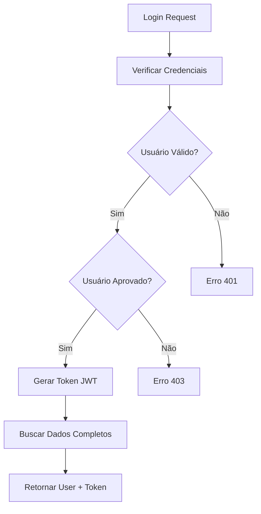
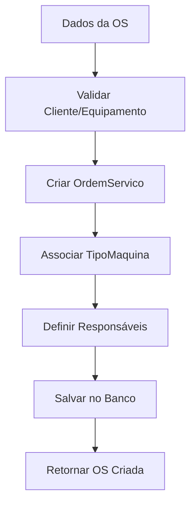
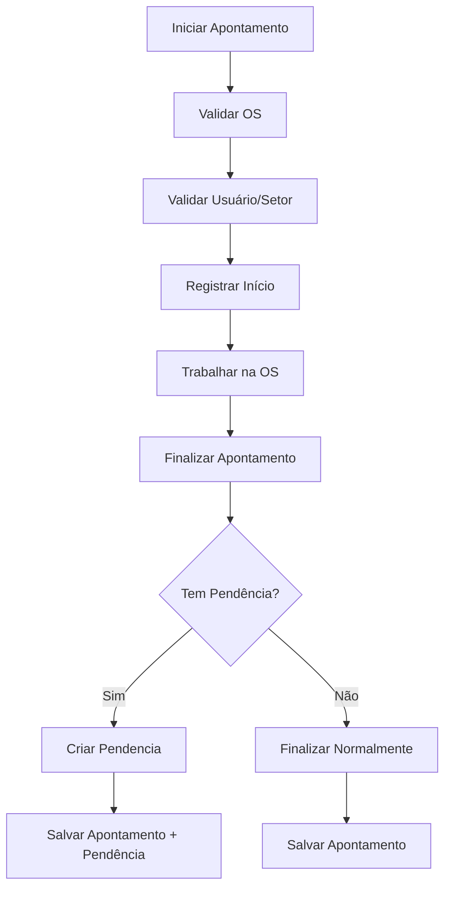
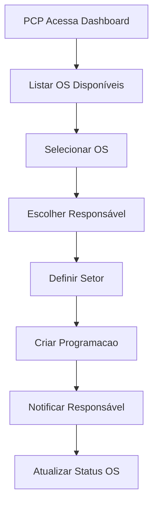
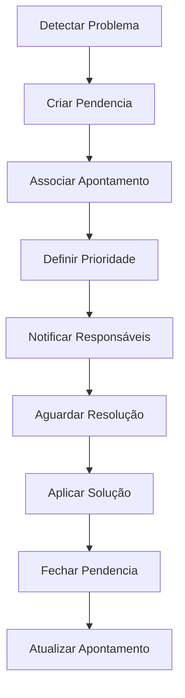

# 📋 Documentação Completa: Rotas, Endpoints, Tabelas e Relacionamentos

## 📖 Índice

1. [Rotas e Endpoints](#rotas-e-endpoints)
2. [Tabelas do Banco de Dados](#tabelas-do-banco-de-dados)
3. [Relacionamentos entre Tabelas](#relacionamentos-entre-tabelas)
4. [Fluxos de Dados por Módulo](#fluxos-de-dados-por-m%C3%B3dulo)

---

## 🔗 1. Rotas e Endpoints

### 1.1 🔐 Autenticação (/api/auth)

| Rota | Endpoint | Método | Descrição | Tabelas Envolvidas |
|------|----------|--------|-----------|-------------------|
| Login | `/api/login` | POST | Autenticação de usuário e criação de token | Usuario |
| Login | `/api/token` | POST | Autenticação alternativa com formulário | Usuario |
| Logout | `/api/logout` | POST | Encerrar sessão | - |
| Cadastro | `/api/register` | POST | Registrar novo usuário | Usuario, Setor, Departamento |
| Trocar senha | `/api/change-password` | PUT | Alterar senha do usuário | Usuario |
| Meus dados | `/api/me` | GET | Obter dados do usuário logado | Usuario, Setor, Departamento |
| Debug usuarios | `/api/debug-users` | POST | Debug de usuários (desenvolvimento) | Usuario |
| Test login | `/api/test-login/{user_email}` | POST | Login automático para testes | Usuario |

### 1.2 📊 PCP (Plano e Controle de Produção) (/api/pcp)

| Rota | Endpoint | Método | Descrição | Tabelas Envolvidas |
|------|----------|--------|-----------|-------------------|
| Test | `/api/pcp/test` | GET | Teste de endpoint PCP | - |
| Ordens de serviço | `/api/pcp/ordens-servico` | GET | Listar OS para PCP | OrdemServico, Setor, Departamento |
| Dados formulário | `/api/pcp/programacao-form-data` | GET | Obter dados para formulário de programação | Setor, Usuario, Departamento, OrdemServico, Cliente, Equipamento |
| Supervisores por setor | `/api/pcp/supervisores-por-setor/{setor_id}` | GET | Buscar supervisores de um setor | Usuario, Setor, Departamento |
| Criar programação | `/api/pcp/programacoes` | POST | Criar nova programação | Programacao, OrdemServico, Usuario, Setor, Departamento |
| Listar programações | `/api/pcp/programacoes` | GET | Obter programações | Programacao, OrdemServico, Usuario, Setor, Cliente, Equipamento |
| Dashboard avançado | `/api/pcp/dashboard/avancado` | GET | Dashboard avançado do PCP | Programacao, OrdemServico |
| Alertas | `/api/pcp/alertas` | GET | Alertas do PCP | - |
| Pendências | `/api/pcp/pendencias` | GET | Pendências do PCP | Pendencia, Usuario, OrdemServico, ApontamentoDetalhado, Cliente, Equipamento |
| Pendências dashboard | `/api/pcp/pendencias/dashboard` | GET | Dashboard de pendências | Pendencia, ApontamentoDetalhado |
| Atribuir programação | `/api/pcp/programacoes/atribuir` | POST | Atribuir programação | Programacao, Usuario, Setor, Departamento |
| Editar programação | `/api/pcp/programacoes/{programacao_id}` | PUT | Editar programação | Programacao, Usuario |
| Reatribuir programação | `/api/pcp/programacoes/{programacao_id}/reatribuir` | PATCH | Reatribuir programação | Programacao, Usuario |
| Atribuir múltiplos | `/api/pcp/programacoes/{programacao_id}/atribuir-multiplos` | POST | Atribuir para múltiplos | Programacao, Usuario |
| Cancelar programação | `/api/pcp/programacoes/{programacao_id}` | DELETE | Cancelar programação | Programacao |
| Atualizar status | `/api/pcp/programacoes/{programacao_id}/status` | PATCH | Atualizar status | Programacao |
| Enviar para setor | `/api/pcp/programacoes/{programacao_id}/enviar-setor` | POST | Enviar para setor | Programacao |

### 1.3 🛠️ Desenvolvimento (/api/desenvolvimento)

| Rota | Endpoint | Método | Descrição | Tabelas Envolvidas |
|------|----------|--------|-----------|-------------------|
| Get setores admin | `/api/desenvolvimento/admin/setores` | GET | Obter setores para admin | Setor |
| Setor configuração | `/api/desenvolvimento/setores/{setor_id}/configuracao` | GET | Configuração do setor | Setor |
| Categorias máquina | `/api/desenvolvimento/admin/categorias-maquina` | GET | Categorias de máquina | TipoMaquina |
| Subcategorias por categoria | `/api/desenvolvimento/subcategorias-por-categoria` | GET | Subcategorias por categoria | - |
| Categoria por nome | `/api/desenvolvimento/tipos-maquina/categoria-por-nome` | GET | Categoria por nome tipo | TipoMaquina |
| Subcategorias tipos máquina | `/api/desenvolvimento/tipos-maquina/subcategorias` | GET | Subcategorias de tipos máquina | TipoMaquina |
| Apontamentos | `/api/desenvolvimento/apontamentos` | GET | Obter apontamentos | ApontamentoDetalhado, OrdemServico, Usuario, Cliente, Equipamento, TipoMaquina, TipoAtividade, TipoDescricaoAtividade |
| Meus apontamentos | `/api/desenvolvimento/os/apontamentos/meus` | GET | Meus apontamentos | ApontamentoDetalhado, Usuario |
| Criar apontamento | `/api/desenvolvimento/os/apontamentos` | POST | Criar apontamento | ApontamentoDetalhado, OrdemServico, Usuario, TipoMaquina, TipoAtividade, TipoDescricaoAtividade, Cliente, Equipamento, TipoCausaRetrabalho, Pendencia |
| Deletar minhas OS | `/api/desenvolvimento/minhas-os` | DELETE | Deletar OS | ApontamentoDetalhado |
| Aprovar apontamento | `/api/desenvolvimento/apontamentos/{apontamento_id}/aprovar` | PUT | Aprovar apontamento | ApontamentoDetalhado, Programacao, Usuario |
| Rejeitar apontamento | `/api/desenvolvimento/apontamentos/{apontamento_id}/rejeitar` | PUT | Rejeitar apontamento | ApontamentoDetalhado, Usuario |
| Finalizar apontamento | `/api/desenvolvimento/apontamentos/{apontamento_id}/finalizar` | PATCH | Finalizar apontamento | ApontamentoDetalhado, Programacao, Pendencia |
| Editar apontamento | `/api/desenvolvimento/apontamentos/{apontamento_id}/editar` | PUT | Editar apontamento | ApontamentoDetalhado |
| Tipos máquina formulário | `/api/desenvolvimento/formulario/tipos-maquina` | GET | Tipos máquina para formulário | TipoMaquina |
| Atividades por tipo máquina | `/api/desenvolvimento/formulario/atividades/{tipo_maquina_id}` | GET | Atividades por tipo máquina | TipoTeste |
| Causas retrabalho | `/api/desenvolvimento/formulario/causas-retrabalho` | GET | Causas retrabalho | TipoCausaRetrabalho |
| Tipos atividade | `/api/desenvolvimento/formulario/tipos-atividade` | GET | Tipos atividade | TipoAtividade |
| Descrições atividade | `/api/desenvolvimento/formulario/descricoes-atividade` | GET | Descrições atividade | TipoDescricaoAtividade |
| Buscar IDs OS | `/api/desenvolvimento/buscar-ids-os` | POST | Buscar IDs das OS | OrdemServico, Cliente, Equipamento |
| Teste simples | `/api/desenvolvimento/formulario/teste-simples/{numero_os}` | GET | Teste scraping simples | - |
| Teste scraping | `/api/desenvolvimento/formulario/teste-scraping/{numero_os}` | GET | Teste scraping com logs | - |
| **Buscar OS assíncrono** | `/api/desenvolvimento/buscar-os-async/{numero_os}` | POST | **Scraping assíncrono com Celery** | OrdemServico, Cliente, Equipamento |
| **Status scraping** | `/api/desenvolvimento/scraping-status/{task_id}` | GET | **Status da task assíncrona** | - |
| **Status fila** | `/api/desenvolvimento/queue-status` | GET | **Status da fila Celery/Redis** | - |
| Buscar OS formulário | `/api/desenvolvimento/formulario/buscar-os/{numero_os}` | GET | Buscar OS para formulário | OrdemServico, Cliente, Equipamento |
| Programação | `/api/desenvolvimento/programacao` | GET | Obter programação | Programacao, OrdemServico, Usuario, Setor, Departamento |
| Colaboradores | `/api/desenvolvimento/colaboradores` | GET | Buscar colaboradores | Usuario, Setor |
| Pendências | `/api/desenvolvimento/pendencias` | GET | Obter pendências | Pendencia, ApontamentoDetalhado, Usuario, Setor, Equipamento, OrdemServico |
| Resolver pendência | `/api/desenvolvimento/pendencias/{pendencia_id}/resolver` | PATCH | Resolver pendência | Pendencia, Usuario |
| Programações lista | `/api/desenvolvimento/programacoes-lista` | GET | Listar programações | Programacao, OrdemServico, Usuario |
| Alertas | `/api/desenvolvimento/alertas` | GET | Alertas do usuário | Programacao, Usuario |
| Minhas programações | `/api/desenvolvimento/minhas-programacoes` | GET | Minhas programações | Programacao, OrdemServico, Usuario, Cliente, Equipamento |
| Verificar programação OS | `/api/desenvolvimento/verificar-programacao-os/{os_numero}` | GET | Verificar programação por OS | Programacao, OrdemServico, Usuario |
| Finalizar atividade | `/api/desenvolvimento/finalizar-atividade` | POST | Finalizar atividade | Programacao |
| Finalizar programação | `/api/desenvolvimento/finalizar-programacao` | POST | Finalizar programação | Programacao, OrdemServico |
| Criar programação | `/api/desenvolvimento/programacao` | POST | Criar programação | Programacao, OrdemServico, Usuario, Setor, Departamento |
| Finalizar programação (patch) | `/api/desenvolvimento/programacao/{programacao_id}/finalizar` | PATCH | Finalizar programação | Programacao |
| Criar notificação | `/api/desenvolvimento/notificacoes` | POST | Criar notificação | - |

### 1.4 📋 OS (Ordens de Serviço) (/api/os)

| Rota | Endpoint | Método | Descrição | Tabelas Envolvidas |
|------|----------|--------|-----------|-------------------|
| Listar OS | `/api/os/` | GET | Listar ordens de serviço | OrdemServico, ApontamentoDetalhado, Usuario, Setor, Cliente, Equipamento, Pendencia |
| Obter OS | `/api/os/{os_id}` | GET | Obter detalhes da OS | OrdemServico, Cliente, TipoMaquina |
| Status summary | `/api/os/{os_id}/status-summary` | GET | Resumo de status da OS | OrdemServico |
| Atualizar status setor | `/api/os/{os_id}/status-setor` | POST | Atualizar status do setor | OrdemServico |
| Listar apontamentos | `/api/os/{os_id}/apontamentos` | GET | Listar apontamentos da OS | ApontamentoDetalhado |
| Dashboard geral | `/api/os/dashboard/geral` | GET | Dashboard geral do sistema | OrdemServico, ApontamentoDetalhado, Usuario, Pendencia |

### 1.5 👤 Usuários (/api/users)

| Rota | Endpoint | Método | Descrição | Tabelas Envolvidas |
|------|----------|--------|-----------|-------------------|
| Listar usuários | `/api/users/usuarios/` | GET | Listar usuários aprovados | Usuario, Setor, Departamento |
| Usuários root | `/api/users/` | GET | Listar todos usuários | Usuario |
| Usuários pendentes | `/api/users/pending-approval` | GET | Usuários pendentes aprovação | Usuario |
| Usuários pendentes alt | `/api/users/usuarios/pendentes/` | GET | Usuários pendentes (alternativo) | Usuario |
| Aprovar usuário | `/api/users/usuarios/{user_id}/approve` | PUT | Aprovar usuário | Usuario |
| Rejeitar usuário | `/api/users/usuarios/{user_id}/reject` | PUT | Rejeitar usuário | Usuario |
| Criar usuário | `/api/users/create-user` | POST | Criar novo usuário | Usuario |

### 1.6 👨‍💼 Administrador (/api/admin)

| Rota | Endpoint | Método | Descrição | Tabelas Envolvidas |
|------|----------|--------|-----------|-------------------|
| Dashboard | `/api/admin/dashboard` | GET | Dashboard administrativo | Usuario, OrdemServico, ApontamentoDetalhado, Pendencia, Programacao |
| Usuários | `/api/admin/usuarios` | GET | Listar todos os usuários | Usuario |
| Aprovar usuário | `/api/admin/usuarios/{usuario_id}/aprovar` | POST | Aprovar usuário | Usuario |
| Reprovar usuário | `/api/admin/usuarios/{usuario_id}/reprovar` | POST | Reprovar usuário | Usuario |
| Editar usuário | `/api/admin/usuarios/{usuario_id}` | PUT | Editar usuário | Usuario |
| Deletar usuário | `/api/admin/usuarios/{usuario_id}` | DELETE | Deletar usuário | Usuario |
| Setores | `/api/admin/setores` | GET | Listar setores | Setor |
| Departamentos | `/api/admin/departamentos` | GET | Listar departamentos | Departamento |
| Tipos máquina | `/api/admin/tipos-maquina` | GET | Listar tipos de máquina | TipoMaquina |
| Tipos atividade | `/api/admin/tipos-atividade` | GET | Listar tipos de atividade | TipoAtividade |
| Tipos teste | `/api/admin/tipos-teste` | GET | Listar tipos de teste | TipoTeste |
| Causas retrabalho | `/api/admin/causas-retrabalho` | GET | Listar causas retrabalho | TipoCausaRetrabalho |
| Pendências | `/api/admin/pendencias` | GET | Listar todas pendências | Pendencia, ApontamentoDetalhado, Usuario |
| Resolução pendências | `/api/admin/pendencias/{id}/resolver` | PATCH | Resolver pendência | Pendencia |
| Programações | `/api/admin/programacoes` | GET | Listar todas programações | Programacao, OrdemServico, Usuario, Setor |
| Editar programação | `/api/admin/programacoes/{id}` | PUT | Editar programação | Programacao |
| Relatórios | `/api/admin/relatorios` | GET | Acessar relatórios | OrdemServico, ApontamentoDetalhado, Usuario, Pendencia, Programacao |

### 1.7 ⚙️ Configuração Admin (/api/admin/config)

| Rota | Endpoint | Método | Descrição | Tabelas Envolvidas |
|------|----------|--------|-----------|-------------------|
| Departamentos | `/api/admin/config/departamento` | GET/POST | Gerenciar departamentos | Departamento |
| Setores | `/api/admin/config/setor` | GET/POST/PUT/DELETE | Gerenciar setores | Setor, Departamento |
| Tipos máquina | `/api/admin/config/tipos-maquina` | GET/POST/PUT/DELETE | Gerenciar tipos de máquina | TipoMaquina |
| Tipos teste | `/api/admin/config/tipos-teste` | GET/POST/PUT/DELETE | Gerenciar tipos de teste | TipoTeste |
| Atividades | `/api/admin/config/atividades` | GET/POST/PUT/DELETE | Gerenciar atividades | TipoAtividade |
| Descrições atividades | `/api/admin/config/descricoes-atividade` | GET/POST/PUT/DELETE | Gerenciar descrições atividades | TipoDescricaoAtividade |
| Tipos falha | `/api/admin/config/tipos-falha` | GET/POST/PUT/DELETE | Gerenciar tipos de falha | TipoFalha |
| Causas retrabalho | `/api/admin/config/causas-retrabalho` | GET/POST/PUT/DELETE | Gerenciar causas retrabalho | TipoCausaRetrabalho |
| Estrutura hierárquica | `/api/admin/config/estrutura-hierarquica` | GET/POST | Gerenciar estrutura hierárquica | Departamento, Setor, Usuario |

### 1.8 📈 Gestão (/api/gestao)

| Rota | Endpoint | Método | Descrição | Tabelas Envolvidas |
|------|----------|--------|-----------|-------------------|
| Dashboard | `/api/gestao/dashboard` | GET | Dashboard de gestão | OrdemServico, ApontamentoDetalhado, Usuario, Pendencia, Programacao, Setor, Departamento |
| Relatórios | `/api/gestao/relatorios` | GET | Relatórios de gestão | OrdemServico, ApontamentoDetalhado, Usuario, Pendencia, Programacao |
| Aprovações | `/api/gestao/aprovacoes` | GET | Tarefas de aprovação | ApontamentoDetalhado, Programacao, Usuario |
| Métricas | `/api/gestao/metricas` | GET | Métricas de gestão | OrdemServico, ApontamentoDetalhado, Usuario, Pendencia, Programacao, Setor, Departamento |
| Auditoria | `/api/gestao/auditoria` | GET | Logs de auditoria | Usuario, OrdemServico, ApontamentoDetalhado, Programacao, Pendencia |

### 1.9 📊 Relatórios (/api/relatorio-completo)

| Rota | Endpoint | Método | Descrição | Tabelas Envolvidas |
|------|----------|--------|-----------|-------------------|
| Relatório completo | `/api/relatorio-completo` | GET | Relatório completo | OrdemServico, ApontamentoDetalhado, Usuario, Pendencia, Programacao, Setor, Departamento, Cliente, Equipamento, TipoMaquina, TipoAtividade, TipoDescricaoAtividade, TipoCausaRetrabalho, TipoTeste |
| Exportar PDF | `/api/relatorio-completo/export/pdf` | GET | Exportar relatório em PDF | Todas as tabelas |
| Exportar Excel | `/api/relatorio-completo/export/excel` | GET | Exportar relatório em Excel | Todas as tabelas |

### 1.10 🌐 Global (/api)

| Rota | Endpoint | Método | Descrição | Tabelas Envolvidas |
|------|----------|--------|-----------|-------------------|
| Root | `/` | GET | API status | - |
| Health | `/health` | GET | Health check | - |
| Health general | `/api/health` | GET | Health check geral | - |
| Test endpoint | `/api/test-endpoint` | GET | Endpoint de teste | - |
| Check access | `/api/check-development-access/{sector}` | GET | Verificar acesso ao setor | Usuario |
| Save apontamento | `/api/save-apontamento` | POST | Salvar apontamento | ApontamentoDetalhado, OrdemServico, Usuario |
| Save com pendência | `/api/save-apontamento-with-pendencia` | POST | Salvar apontamento com pendência | ApontamentoDetalhado, Pendencia, OrdemServico, Usuario |
| Listar pendências | `/api/pendencias` | GET | Listar pendências | Pendencia, Usuario |
| Atualizar pendência | `/api/pendencias/{pendencia_id}` | PUT | Atualizar pendência | Pendencia, Usuario |
| Meus apontamentos | `/api/os/apontamentos/meus` | GET | Meus apontamentos | ApontamentoDetalhado, OrdemServico, Usuario |
| Listar OS | `/api/os/` | GET | Listar ordens de serviço | OrdemServico, Cliente, Equipamento, Usuario |
| User info | `/api/user-info` | GET | Informações do usuário | Usuario, Setor, Departamento |
| Scraping OS | `/api/scraping/consulta-os` | POST | Consultar OS via scraping | OrdemServico, Cliente, Equipamento |
| Categorias máquina | `/api/tipos-maquina/categorias` | GET | Categorias de máquina | TipoMaquina |
| Programação testes | `/api/programacao-testes` | GET | Listar programação testes | Programacao, OrdemServico |
| Status programação | `/api/programacao-testes/{programacao_id}/status` | PUT | Atualizar status programação | Programacao |
| Relatório apontamento | `/api/apontamentos/{apontamento_id}/relatorio-completo` | GET | Relatório completo apontamento | ApontamentoDetalhado, OrdemServico, Usuario |
| Ordens serviço globais | `/api/ordens-servico` | GET | OS globais simplificadas | OrdemServico |
| Programações globais | `/api/programacoes` | GET | Programações globais simplificadas | Programacao |
| Apontamentos detalhados | `/api/apontamentos-detalhados` | GET | Apontamentos detalhados | ApontamentoDetalhado, Usuario, OrdemServico, Cliente, Equipamento |

### 1.11 📚 Catálogos (/api)

| Rota | Endpoint | Método | Descrição | Tabelas Envolvidas |
|------|----------|--------|-----------|-------------------|
| Departamentos | `/api/departamentos` | GET | Listar departamentos | Departamento |
| Setores | `/api/setores` | GET | Listar setores | Setor, Departamento |
| Estrutura hierárquica | `/api/estrutura-hierarquica` | GET | Estrutura completa | Departamento, Setor, TipoMaquina, TipoAtividade |
| Tipos máquina | `/api/tipos-maquina` | GET | Listar tipos de máquina | TipoMaquina, Departamento |
| Tipos teste | `/api/tipos-teste` | GET | Listar tipos de teste | TipoTeste |
| Tipos teste valores | `/api/tipos-teste-valores` | GET | Valores únicos tipo teste | TipoTeste |
| Clientes | `/api/clientes` | GET | Listar clientes | Cliente |
| Equipamentos | `/api/equipamentos` | GET | Listar equipamentos | Equipamento |
| Usuários | `/api/usuarios` | GET | Listar usuários | Usuario, Setor, Departamento |
| Tipo atividade | `/api/tipo-atividade` | GET | Listar tipos atividade | TipoAtividade, Departamento |
| Descrição atividade | `/api/descricao-atividade` | GET | Listar descrições atividade | TipoDescricaoAtividade, Departamento |
| Tipo falha | `/api/tipo-falha` | GET | Listar tipos falha | TipoFalha |
| Causas retrabalho | `/api/causas-retrabalho` | GET | Listar causas retrabalho | TipoCausaRetrabalho |
| Ordens serviço | `/api/ordens-servico` | GET | Listar ordens serviço | OrdemServico, Cliente, Equipamento |
| Status catálogos | `/api/status` | GET | Status dos catálogos | - |
| Health catálogos | `/api/health` | GET | Health check catálogos | - |

---

## 🗄️ 2. Tabelas do Banco de Dados

### 2.1 🏷️ Tabela Principal - OrdemServico

| Coluna | Tipo | Descrição | Relacionamentos |
|--------|------|-----------|-----------------|
| id | Integer | ID primário | - |
| os_numero | String | Número da OS | - |
| status_os | String | Status da OS | - |
| prioridade | String | Prioridade (ALTA, MEDIA, BAIXA) | - |
| id_responsavel_registro | Integer | Responsável pelo registro | Usuario |
| id_responsavel_pcp | Integer | Responsável PCP | Usuario |
| id_responsavel_final | Integer | Responsável final | Usuario |
| data_inicio_prevista | DateTime | Data início prevista | - |
| data_fim_prevista | DateTime | Data fim prevista | - |
| data_criacao | DateTime | Data de criação | - |
| data_ultima_atualizacao | DateTime | Última atualização | - |
| criado_por | Integer | Criado por | Usuario |
| status_geral | String | Status geral | - |
| valor_total_previsto | Decimal | Valor total previsto | - |
| valor_total_real | Decimal | Valor total real | - |
| observacoes_gerais | Text | Observações gerais | - |
| id_tipo_maquina | Integer | ID tipo máquina | TipoMaquina |
| custo_total_real | Decimal | Custo total real | - |
| horas_previstas | Decimal | Horas previstas | - |
| horas_reais | Decimal | Horas reais | - |
| data_programacao | DateTime | Data programação | - |
| horas_orcadas | Decimal | Horas orçadas | - |
| testes_iniciais_finalizados | Boolean | Testes iniciais finalizados | - |
| testes_parciais_finalizados | Boolean | Testes parciais finalizados | - |
| testes_finais_finalizados | Boolean | Testes finais finalizados | - |
| data_testes_iniciais_finalizados | DateTime | Data testes iniciais | - |
| data_testes_parciais_finalizados | DateTime | Data testes parciais | - |
| data_testes_finais_finalizados | DateTime | Data testes finais | - |
| id_usuario_testes_iniciais | Integer | Usuário testes iniciais | Usuario |
| id_usuario_testes_parciais | Integer | Usuário testes parciais | Usuario |
| id_usuario_testes_finais | Integer | Usuário testes finais | Usuario |
| testes_exclusivo_os | Text | Testes exclusivos da OS | - |
| id_cliente | Integer | ID cliente | Cliente |
| id_equipamento | Integer | ID equipamento | Equipamento |
| id_setor | Integer | ID setor | Setor |
| id_departamento | Integer | ID departamento | Departamento |
| inicio_os | DateTime | Início da OS | - |
| fim_os | DateTime | Fim da OS | - |
| descricao_maquina | Text | Descrição da máquina | - |

### 2.2 ⏱️ Tabela - ApontamentoDetalhado

| Coluna | Tipo | Descrição | Relacionamentos |
|--------|------|-----------|-----------------|
| id | Integer | ID primário | - |
| id_os | Integer | ID da OS | OrdemServico |
| id_usuario | Integer | ID do usuário | Usuario |
| id_setor | Integer | ID do setor | Setor |
| data_hora_inicio | DateTime | Data/hora início | - |
| data_hora_fim | DateTime | Data/hora fim | - |
| status_apontamento | String | Status do apontamento | - |
| foi_retrabalho | Boolean | Foi retrabalho | - |
| causa_retrabalho | Integer | ID causa retrabalho | TipoCausaRetrabalho |
| observacao_os | Text | Observação OS | - |
| servico_de_campo | Boolean | Serviço de campo | - |
| observacoes_gerais | Text | Observações gerais | - |
| aprovado_supervisor | Boolean | Aprovado supervisor | - |
| data_aprovacao_supervisor | DateTime | Data aprovação supervisor | - |
| supervisor_aprovacao | Integer | ID supervisor aprovação | Usuario |
| criado_por | Integer | Criado por | Usuario |
| criado_por_email | String | Email criado por | - |
| data_processo_finalizado | DateTime | Data processo finalizado | - |
| setor | String | Setor (compatibilidade) | - |
| horas_orcadas | Decimal | Horas orçadas | - |
| etapa_inicial | Boolean | Etapa inicial | - |
| etapa_parcial | Boolean | Etapa parcial | - |
| etapa_final | Boolean | Etapa final | - |
| horas_etapa_inicial | Decimal | Horas etapa inicial | - |
| horas_etapa_parcial | Decimal | Horas etapa parcial | - |
| horas_etapa_final | Decimal | Horas etapa final | - |
| observacoes_etapa_inicial | Text | Observações etapa inicial | - |
| observacoes_etapa_parcial | Text | Observações etapa parcial | - |
| observacoes_etapa_final | Text | Observações etapa final | - |
| data_etapa_inicial | DateTime | Data etapa inicial | - |
| data_etapa_parcial | DateTime | Data etapa parcial | - |
| data_etapa_final | DateTime | Data etapa final | - |
| supervisor_etapa_inicial | Integer | Supervisor etapa inicial | Usuario |
| supervisor_etapa_parcial | Integer | Supervisor etapa parcial | Usuario |
| supervisor_etapa_final | Integer | Supervisor etapa final | Usuario |
| tipo_maquina | Integer | ID tipo máquina | TipoMaquina |
| tipo_atividade | Integer | ID tipo atividade | TipoAtividade |
| descricao_atividade | Integer | ID descrição atividade | TipoDescricaoAtividade |
| **categoria_maquina** | **String** | **Categoria máquina** | **-** |
| **subcategorias_maquina** | **Text** | **Subcategorias máquina** | **-** |
| **subcategorias_finalizadas** | **Boolean** | **Subcategorias finalizadas** | **-** |
| **data_finalizacao_subcategorias** | **DateTime** | **Data finalização subcategorias** | **-** |
| **emprestimo_setor** | **String** | **Empréstimo setor** | **-** |
| **pendencia** | **Boolean** | **Pendência** | **-** |
| **pendencia_data** | **DateTime** | **Data pendência** | **-** |
| **resultado_global** | **String** | **Resultado global** | **-** |

### 2.3 🚨 Tabela - Pendencia

| Coluna | Tipo | Descrição | Relacionamentos |
|--------|------|-----------|-----------------|
| id | Integer | ID primário | - |
| numero_os | String | Número da OS | OrdemServico |
| cliente | String | Cliente | - |
| data_inicio | DateTime | Data início | - |
| id_responsavel_inicio | Integer | ID responsável início | Usuario |
| tipo_maquina | String | Tipo máquina | - |
| descricao_maquina | Text | Descrição máquina | - |
| descricao_pendencia | Text | Descrição pendência | - |
| status | String | Status (ABERTA, FECHADA) | - |
| prioridade | String | Prioridade | - |
| data_fechamento | DateTime | Data fechamento | - |
| id_responsavel_fechamento | Integer | ID responsável fechamento | Usuario |
| solucao_aplicada | Text | Solução aplicada | - |
| observacoes_fechamento | Text | Observações fechamento | - |
| id_apontamento_origem | Integer | ID apontamento origem | ApontamentoDetalhado |
| id_apontamento_fechamento | Integer | ID apontamento fechamento | ApontamentoDetalhado |
| tempo_aberto_horas | Float | Tempo aberto horas | - |
| data_criacao | DateTime | Data criação | - |
| data_ultima_atualizacao | DateTime | Última atualização | - |
| setor_origem | String | Setor origem | - |
| departamento_origem | String | Departamento origem | - |

### 2.4 📅 Tabela - Programacao

| Coluna | Tipo | Descrição | Relacionamentos |
|--------|------|-----------|-----------------|
| id | Integer | ID primário | - |
| id_ordem_servico | Integer | ID ordem serviço | OrdemServico |
| criado_por_id | Integer | Criado por | Usuario |
| responsavel_id | Integer | Responsável | Usuario |
| observacoes | Text | Observações | - |
| historico | Text | Histórico | - |
| status | String | Status | - |
| inicio_previsto | DateTime | Início previsto | - |
| fim_previsto | DateTime | Fim previsto | - |
| created_at | DateTime | Criado em | - |
| updated_at | DateTime | Atualizado em | - |
| id_setor | Integer | ID setor | Setor |

### 2.5 ✅ Tabela - ResultadoTeste

| Coluna | Tipo | Descrição | Relacionamentos |
|--------|------|-----------|-----------------|
| id | Integer | ID primário | - |
| id_apontamento | Integer | ID apontamento | ApontamentoDetalhado |
| id_teste | Integer | ID teste | TipoTeste |
| resultado | String | Resultado | - |
| observacao | Text | Observação | - |
| data_registro | DateTime | Data registro | - |

### 2.6 🧪 Tabela - OSTestesExclusivosFinalizados

| Coluna | Tipo | Descrição | Relacionamentos |
|--------|------|-----------|-----------------|
| id | Integer | ID primário | - |
| numero_os | String | Número OS | OrdemServico |
| id_teste_exclusivo | Integer | ID teste exclusivo | TipoTeste |
| nome_teste | String | Nome teste | - |
| descricao_teste | String | Descrição teste | - |
| usuario_finalizacao | Integer | Usuário finalização | Usuario |
| departamento | String | Departamento | - |
| setor | String | Setor | - |
| data_finalizacao | Date | Data finalização | - |
| hora_finalizacao | Time | Hora finalização | - |
| descricao_atividade | Text | Descrição atividade | - |
| observacoes | Text | Observações | - |
| data_criacao | DateTime | Data criação | - |

### 2.7 🤝 Tabela Referencial - Cliente

| Coluna | Tipo | Descrição | Relacionamentos |
|--------|------|-----------|-----------------|
| id | Integer | ID primário | - |
| razao_social | String | Razão social | - |
| nome_fantasia | String | Nome fantasia | - |
| cnpj_cpf | String | CNPJ/CPF | - |
| contato_principal | String | Contato principal | - |
| telefone_contato | String | Telefone contato | - |
| email_contato | String | Email contato | - |
| endereco | Text | Endereço | - |
| data_criacao | DateTime | Data criação | - |
| data_ultima_atualizacao | DateTime | Última atualização | - |

### 2.8 🛠️ Tabela Referencial - Equipamento

| Coluna | Tipo | Descrição | Relacionamentos |
|--------|------|-----------|-----------------|
| id | Integer | ID primário | - |
| descricao | Text | Descrição | - |
| tipo | String | Tipo | - |
| fabricante | String | Fabricante | - |
| modelo | String | Modelo | - |
| numero_serie | String | Número série | - |
| data_criacao | DateTime | Data criação | - |
| data_ultima_atualizacao | DateTime | Última atualização | - |

### 2.9 👤 Tabela Referencial - Usuario (TipoUsuario)

| Coluna | Tipo | Descrição | Relacionamentos |
|--------|------|-----------|-----------------|
| id | Integer | ID primário | - |
| nome_completo | String | Nome completo | - |
| nome_usuario | String | Nome usuário | - |
| email | String | Email | - |
| matricula | String | Matrícula | - |
| senha_hash | String | Senha hash | - |
| setor | String | Setor | - |
| cargo | String | Cargo | - |
| departamento | String | Departamento | - |
| privilege_level | String | Nível privilégio | - |
| is_approved | Boolean | Aprovado | - |
| data_criacao | DateTime | Data criação | - |
| data_ultima_atualizacao | DateTime | Última atualização | - |
| trabalha_producao | Boolean | Trabalha produção | - |
| obs_reprovacao | Text | Observação reprovação | - |
| id_setor | Integer | ID setor | Setor |
| id_departamento | Integer | ID departamento | Departamento |
| primeiro_login | Boolean | Primeiro login | - |

### 2.10 🏗️ Tabela Referencial - Setor (TipoSetor)

| Coluna | Tipo | Descrição | Relacionamentos |
|--------|------|-----------|-----------------|
| id | Integer | ID primário | - |
| nome | String | Nome | - |
| departamento | String | Departamento | - |
| descricao | Text | Descrição | - |
| ativo | Boolean | Ativo | - |
| data_criacao | DateTime | Data criação | - |
| data_ultima_atualizacao | DateTime | Última atualização | - |
| id_departamento | Integer | ID departamento | Departamento |
| area_tipo | String | Área tipo | - |
| supervisor_responsavel | Integer | Supervisor responsável | Usuario |
| permite_apontamento | Boolean | Permite apontamento | - |

### 2.11 🔧 Tabela Referencial - TipoMaquina

| Coluna | Tipo | Descrição | Relacionamentos |
|--------|------|-----------|-----------------|
| id | Integer | ID primário | - |
| nome_tipo | String | Nome tipo | - |
| categoria | String | Categoria | - |
| **subcategoria** | **JSON** | **Subcategoria (array JSON)** | **-** |
| descricao | Text | Descrição | - |
| ativo | Boolean | Ativo | - |
| data_criacao | DateTime | Data criação | - |
| data_ultima_atualizacao | DateTime | Última atualização | - |
| id_departamento | Integer | ID departamento | Departamento |
| **especificacoes_tecnicas** | **Text** | **Especificações técnicas (compatibilidade)** | **-** |
| **campos_teste_resultado** | **Text** | **Campos teste resultado (compatibilidade)** | **-** |
| **setor** | **String** | **Setor (compatibilidade)** | **-** |
| **departamento** | **Text** | **Departamento (compatibilidade)** | **-** |

### 2.12 🎯 Tabela Referencial - TipoAtividade

| Coluna | Tipo | Descrição | Relacionamentos |
|--------|------|-----------|-----------------|
| id | Integer | ID primário | - |
| nome_tipo | String | Nome tipo | - |
| descricao | Text | Descrição | - |
| categoria | String | Categoria | - |
| ativo | Boolean | Ativo | - |
| data_criacao | DateTime | Data criação | - |
| data_ultima_atualizacao | DateTime | Última atualização | - |
| id_tipo_maquina | Integer | ID tipo máquina | TipoMaquina |
| id_departamento | Integer | ID departamento | Departamento |
| **departamento** | **String** | **Departamento (compatibilidade)** | **-** |
| **setor** | **String** | **Setor (compatibilidade)** | **-** |

### 2.13 📝 Tabela Referencial - TipoDescricaoAtividade

| Coluna | Tipo | Descrição | Relacionamentos |
|--------|------|-----------|-----------------|
| id | Integer | ID primário | - |
| codigo | String | Código | - |
| descricao | Text | Descrição | - |
| categoria | String | Categoria | - |
| ativo | Boolean | Ativo | - |
| data_criacao | DateTime | Data criação | - |
| data_ultima_atualizacao | DateTime | Última atualização | - |
| **setor** | **String** | **Setor (compatibilidade)** | **-** |
| id_departamento | Integer | ID departamento | Departamento |
| **departamento** | **String** | **Departamento (compatibilidade)** | **-** |
| tipo_maquina | Integer | Tipo máquina | TipoMaquina |

### 2.14 🧪 Tabela Referencial - TipoTeste

| Coluna | Tipo | Descrição | Relacionamentos |
|--------|------|-----------|-----------------|
| id | Integer | ID primário | - |
| nome | String | Nome | - |
| descricao | Text | Descrição | - |
| tipo_teste | String | Tipo teste | - |
| tipo_maquina | String | Tipo máquina | - |
| categoria | String | Categoria | - |
| subcategoria | Integer | Subcategoria | - |
| ativo | Boolean | Ativo | - |
| data_criacao | DateTime | Data criação | - |
| data_ultima_atualizacao | DateTime | Última atualização | - |
| **teste_exclusivo_setor** | **Boolean** | **Teste exclusivo setor** | **-** |
| **descricao_teste_exclusivo** | **Text** | **Descrição teste exclusivo** | **-** |

### 2.15 ⚠️ Tabela Referencial - TipoCausaRetrabalho

| Coluna | Tipo | Descrição | Relacionamentos |
|--------|------|-----------|-----------------|
| id | Integer | ID primário | - |
| nome_tipo | String | Nome tipo | - |
| descricao | Text | Descrição | - |
| categoria | String | Categoria | - |
| ativo | Boolean | Ativo | - |
| data_criacao | DateTime | Data criação | - |
| data_ultima_atualizacao | DateTime | Última atualização | - |

### 2.16 🚨 Tabela Referencial - TipoFalha

| Coluna | Tipo | Descrição | Relacionamentos |
|--------|------|-----------|-----------------|
| id | Integer | ID primário | - |
| nome_tipo | String | Nome tipo | - |
| descricao | Text | Descrição | - |
| categoria | String | Categoria | - |
| ativo | Boolean | Ativo | - |
| data_criacao | DateTime | Data criação | - |
| data_ultima_atualizacao | DateTime | Última atualização | - |

### 2.17 🏢 Tabela Referencial - Departamento (TipoDepartamento)

| Coluna | Tipo | Descrição | Relacionamentos |
|--------|------|-----------|-----------------|
| id | Integer | ID primário | - |
| nome_tipo | String | Nome tipo | - |
| descricao | Text | Descrição | - |
| ativo | Boolean | Ativo | - |
| data_criacao | DateTime | Data criação | - |
| data_ultima_atualizacao | DateTime | Última atualização | - |

---

## 🔗 3. Relacionamentos entre Tabelas

### 3.1 🏷️ Relacionamentos Principais

#### OrdemServico (Tabela Central)
- **Cliente**: `id_cliente` → `clientes.id` (Many-to-One)
- **Equipamento**: `id_equipamento` → `equipamentos.id` (Many-to-One)
- **TipoMaquina**: `id_tipo_maquina` → `tipos_maquina.id` (Many-to-One)
- **Setor**: `id_setor` → `tipo_setores.id` (Many-to-One)
- **Departamento**: `id_departamento` → `tipo_departamentos.id` (Many-to-One)
- **Usuários Responsáveis**:
  - `id_responsavel_registro` → `tipo_usuarios.id` (Many-to-One)
  - `id_responsavel_pcp` → `tipo_usuarios.id` (Many-to-One)
  - `id_responsavel_final` → `tipo_usuarios.id` (Many-to-One)
  - `criado_por` → `tipo_usuarios.id` (Many-to-One)
- **Usuários Testes**:
  - `id_usuario_testes_iniciais` → `tipo_usuarios.id` (Many-to-One)
  - `id_usuario_testes_parciais` → `tipo_usuarios.id` (Many-to-One)
  - `id_usuario_testes_finais` → `tipo_usuarios.id` (Many-to-One)

#### ApontamentoDetalhado
- **OrdemServico**: `id_os` → `ordens_servico.id` (Many-to-One)
- **Usuario**: `id_usuario` → `tipo_usuarios.id` (Many-to-One)
- **Setor**: `id_setor` → `tipo_setores.id` (Many-to-One)
- **TipoMaquina**: `tipo_maquina` → `tipos_maquina.id` (Many-to-One)
- **TipoAtividade**: `tipo_atividade` → `tipo_atividade.id` (Many-to-One)
- **TipoDescricaoAtividade**: `descricao_atividade` → `tipo_descricao_atividade.id` (Many-to-One)
- **TipoCausaRetrabalho**: `causa_retrabalho` → `tipo_causas_retrabalho.id` (Many-to-One)
- **Supervisores**:
  - `supervisor_aprovacao` → `tipo_usuarios.id` (Many-to-One)
  - `supervisor_etapa_inicial` → `tipo_usuarios.id` (Many-to-One)
  - `supervisor_etapa_parcial` → `tipo_usuarios.id` (Many-to-One)
  - `supervisor_etapa_final` → `tipo_usuarios.id` (Many-to-One)

#### Pendencia
- **OrdemServico**: `numero_os` → `ordens_servico.os_numero` (Many-to-One)
- **Usuários**:
  - `id_responsavel_inicio` → `tipo_usuarios.id` (Many-to-One)
  - `id_responsavel_fechamento` → `tipo_usuarios.id` (Many-to-One)
- **Apontamentos**:
  - `id_apontamento_origem` → `apontamentos_detalhados.id` (Many-to-One)
  - `id_apontamento_fechamento` → `apontamentos_detalhados.id` (Many-to-One)

#### Programacao
- **OrdemServico**: `id_ordem_servico` → `ordens_servico.id` (Many-to-One)
- **Usuários**:
  - `criado_por_id` → `tipo_usuarios.id` (Many-to-One)
  - `responsavel_id` → `tipo_usuarios.id` (Many-to-One)
- **Setor**: `id_setor` → `tipo_setores.id` (Many-to-One)

### 3.2 🏗️ Hierarquia Organizacional

#### Departamento → Setor → Usuario
```
Departamento (tipo_departamentos)
├── id, nome_tipo, descricao
└── Setor (tipo_setores)
    ├── id, nome, id_departamento
    └── Usuario (tipo_usuarios)
        ├── id, nome_completo, id_setor, id_departamento
        └── privilege_level: USER, SUPERVISOR, GESTAO, ADMIN, PCP
```

#### Departamento → TipoMaquina → TipoAtividade
```
Departamento (tipo_departamentos)
├── TipoMaquina (tipos_maquina)
│   ├── id, nome_tipo, categoria, subcategoria
│   └── id_departamento
└── TipoAtividade (tipo_atividade)
    ├── id, nome_tipo, categoria
    └── id_departamento, id_tipo_maquina
```

### 3.3 🔄 Relacionamentos Reversos

#### OrdemServico (One-to-Many)
- **apontamentos**: `ApontamentoDetalhado.id_os`
- **programacoes**: `Programacao.id_ordem_servico`
- **pendencias**: `Pendencia.numero_os`

#### Usuario (One-to-Many)
- **ordens_criadas**: `OrdemServico.criado_por`
- **ordens_responsavel_registro**: `OrdemServico.id_responsavel_registro`
- **ordens_responsavel_pcp**: `OrdemServico.id_responsavel_pcp`
- **ordens_responsavel_final**: `OrdemServico.id_responsavel_final`
- **apontamentos**: `ApontamentoDetalhado.id_usuario`
- **programacoes_criadas**: `Programacao.criado_por_id`
- **programacoes_responsavel**: `Programacao.responsavel_id`
- **pendencias_inicio**: `Pendencia.id_responsavel_inicio`
- **pendencias_fechamento**: `Pendencia.id_responsavel_fechamento`

#### Setor (One-to-Many)
- **usuarios**: `Usuario.id_setor`
- **ordens_servico**: `OrdemServico.id_setor`
- **apontamentos**: `ApontamentoDetalhado.id_setor`
- **programacoes**: `Programacao.id_setor`

#### Departamento (One-to-Many)
- **setores**: `Setor.id_departamento`
- **usuarios**: `Usuario.id_departamento`
- **tipos_maquina**: `TipoMaquina.id_departamento`
- **tipos_atividade**: `TipoAtividade.id_departamento`
- **descricoes_atividade**: `TipoDescricaoAtividade.id_departamento`

---

## 📊 4. Fluxos de Dados por Módulo

### 4.1 🔐 Fluxo de Autenticação



**Tabelas Envolvidas:**
1. `tipo_usuarios` - Verificação de credenciais e aprovação
2. `tipo_setores` - Dados do setor do usuário
3. `tipo_departamentos` - Dados do departamento do usuário

### 4.2 📋 Fluxo de Criação de OS



**Tabelas Envolvidas:**
1. `ordens_servico` - Registro principal
2. `clientes` - Validação do cliente
3. `equipamentos` - Validação do equipamento
4. `tipos_maquina` - Tipo de máquina
5. `tipo_usuarios` - Responsáveis
6. `tipo_setores` - Setor da OS
7. `tipo_departamentos` - Departamento da OS

### 4.3 ⏱️ Fluxo de Apontamento



**Tabelas Envolvidas:**
1. `apontamentos_detalhados` - Registro do apontamento
2. `ordens_servico` - OS sendo trabalhada
3. `tipo_usuarios` - Usuário executando
4. `tipo_setores` - Setor do apontamento
5. `tipos_maquina` - Tipo de máquina
6. `tipo_atividade` - Tipo de atividade
7. `tipo_descricao_atividade` - Descrição da atividade
8. `tipo_causas_retrabalho` - Se for retrabalho
9. `pendencias` - Se houver pendência

### 4.4 📅 Fluxo de Programação PCP



**Tabelas Envolvidas:**
1. `programacoes` - Registro da programação
2. `ordens_servico` - OS sendo programada
3. `tipo_usuarios` - Responsável e criador
4. `tipo_setores` - Setor de destino
5. `tipo_departamentos` - Departamento

### 4.5 🚨 Fluxo de Pendências



**Tabelas Envolvidas:**
1. `pendencias` - Registro da pendência
2. `apontamentos_detalhados` - Apontamento origem
3. `ordens_servico` - OS relacionada
4. `tipo_usuarios` - Responsáveis

---

## 🏗️ 5. Arquitetura e Tecnologias

### 5.1 🔧 Stack Tecnológico

#### Backend
- **Framework**: FastAPI 0.104.1
- **ORM**: SQLAlchemy 2.0+
- **Banco de Dados**: SQLite (registroos_new.db)
- **Autenticação**: JWT com HttpOnly Cookies
- **Validação**: Pydantic Models
- **CORS**: Configurado para localhost:3000 e localhost:3001

#### Frontend
- **Framework**: React 18+ com TypeScript
- **Styling**: Tailwind CSS
- **Roteamento**: React Router DOM
- **Estado**: Context API + useState/useEffect
- **HTTP Client**: Fetch API nativo
- **Build**: Vite

#### Banco de Dados
- **Tipo**: SQLite
- **Arquivo**: `registroos_new.db`
- **Localização**: `RegistroOS/registrooficial/backend/`
- **Migrations**: SQLAlchemy Alembic (quando necessário)

### 5.2 📁 Estrutura de Diretórios

```
RegistroOS/
├── registrooficial/
│   ├── backend/                 # API FastAPI
│   │   ├── app/                # Modelos e dependências
│   │   │   ├── database_models.py
│   │   │   ├── dependencies.py
│   │   │   └── auth.py
│   │   ├── routes/             # Endpoints organizados
│   │   │   ├── auth.py
│   │   │   ├── pcp_routes.py
│   │   │   ├── desenvolvimento.py
│   │   │   ├── admin_routes_simple.py
│   │   │   ├── admin_config_routes.py
│   │   │   ├── gestao_routes.py
│   │   │   ├── users.py
│   │   │   ├── os_routes_simple.py
│   │   │   ├── general.py
│   │   │   ├── relatorio_completo.py
│   │   │   └── catalogs_validated_clean.py
│   │   ├── config/             # Configurações
│   │   │   └── database_config.py
│   │   ├── utils/              # Utilitários
│   │   ├── scripts/            # Scripts auxiliares
│   │   ├── main.py             # Aplicação principal
│   │   └── registroos_new.db   # Banco SQLite
│   └── frontend/               # Interface React
│       ├── src/
│       │   ├── components/     # Componentes reutilizáveis
│       │   ├── features/       # Funcionalidades por módulo
│       │   │   ├── admin/
│       │   │   ├── auth/
│       │   │   ├── pcp/
│       │   │   ├── desenvolvimento/
│       │   │   └── gestao/
│       │   ├── services/       # APIs e serviços
│       │   ├── contexts/       # Context providers
│       │   ├── hooks/          # Custom hooks
│       │   └── types/          # TypeScript types
│       ├── public/
│       └── package.json
└── SCRATCK HERE/               # Testes e documentação
```

### 5.3 🔐 Segurança e Autenticação

#### Níveis de Privilégio
1. **USER** - Usuário básico (apontamentos)
2. **SUPERVISOR** - Supervisor de setor (aprovações)
3. **GESTAO** - Gestão (relatórios e métricas)
4. **PCP** - Planejamento e Controle (programações)
5. **ADMIN** - Administrador (configurações)

#### Fluxo de Autenticação
1. Login com email/username + senha
2. Verificação de credenciais no banco
3. Verificação de aprovação (`is_approved = True`)
4. Geração de token JWT
5. Armazenamento em HttpOnly Cookie
6. Middleware de verificação em rotas protegidas

#### Proteção de Rotas
- **Públicas**: `/api/login`, `/api/register`, `/health`
- **Autenticadas**: Todas as demais rotas
- **Admin**: `/api/admin/config/*`
- **PCP**: `/api/pcp/*`
- **Gestão**: `/api/gestao/*`

### 5.4 📊 Performance e Otimizações

#### Backend
- **Lazy Loading**: Relacionamentos carregados sob demanda
- **Query Optimization**: Joins otimizados com SQLAlchemy
- **Connection Pooling**: Pool de conexões SQLite
- **Caching**: Cache de consultas frequentes
- **Pagination**: Implementada em listagens grandes

#### Frontend
- **Code Splitting**: Componentes carregados sob demanda
- **Memoization**: React.memo e useMemo
- **Debouncing**: Em campos de busca
- **Virtual Scrolling**: Para listas grandes
- **Bundle Optimization**: Vite com tree-shaking

### 5.5 🔄 Integração e APIs

#### Endpoints Principais
- **Base URL**: `http://localhost:8000`
- **Documentação**: `http://localhost:8000/docs` (Swagger)
- **Health Check**: `http://localhost:8000/health`

#### Padrões de Response
```json
{
  "success": true,
  "data": {...},
  "message": "Operação realizada com sucesso",
  "timestamp": "2025-01-16T10:30:00Z"
}
```

#### Tratamento de Erros
```json
{
  "detail": "Mensagem de erro",
  "status_code": 400,
  "type": "validation_error"
}
```

### 5.6 🧪 Testes e Qualidade

#### Testes Backend
- **Unit Tests**: Pytest para funções críticas
- **Integration Tests**: Testes de endpoints
- **Database Tests**: Testes de modelos SQLAlchemy

#### Testes Frontend
- **Component Tests**: Jest + React Testing Library
- **E2E Tests**: Cypress (planejado)
- **Type Safety**: TypeScript strict mode

#### Qualidade de Código
- **Linting**: ESLint + Prettier (frontend)
- **Type Checking**: mypy (backend), TypeScript (frontend)
- **Code Coverage**: pytest-cov (backend)

### 5.7 🔄 Sistema de Processamento Assíncrono

#### Celery + Redis (Scraping Assíncrono)
- **Broker**: Redis para fila de tarefas
- **Worker**: Celery worker para processamento
- **Tasks**: `scrape_os_task` com retry automático
- **Endpoints**:
  - `POST /api/desenvolvimento/buscar-os-async/{numero_os}` - Iniciar scraping
  - `GET /api/desenvolvimento/scraping-status/{task_id}` - Status da task
  - `GET /api/desenvolvimento/queue-status` - Status da fila

#### Funcionalidades Assíncronas
- **Retry Automático**: 3 tentativas com backoff exponencial
- **Priorização**: Usuários com prioridade diferenciada
- **Estimativa de Tempo**: Cálculo baseado na fila
- **Fallback**: Scraping síncrono se assíncrono falhar
- **Progress Tracking**: Acompanhamento em tempo real

#### Middleware de Validação
- **Arquivo**: `middleware/text_validation_middleware.py`
- **Funcionalidade**: Validação automática de campos de texto
- **Aplicação**: Endpoints específicos com campos definidos
- **Recursos**: Limpeza de caracteres especiais, validação recursiva

### 5.8 🚀 Deploy e Ambiente

#### Desenvolvimento
- **Backend**: `uvicorn main:app --reload --port 8000`
- **Frontend**: `npm run dev` (Vite dev server)
- **Database**: SQLite local
- **Redis**: Para tarefas assíncronas (opcional)
- **Celery**: Worker para processamento assíncrono

#### Produção (Planejado)
- **Backend**: Docker + Gunicorn
- **Frontend**: Build estático + Nginx
- **Database**: PostgreSQL ou MySQL
- **Redis**: Cluster para alta disponibilidade
- **Celery**: Multiple workers com supervisord
- **Proxy**: Nginx reverse proxy

---

## 🔧 6. Detalhes de Implementação Complexos

### 6.1 🔐 Sistema de Autenticação Hierárquico

#### Níveis de Privilégio
```python
PRIVILEGE_LEVELS = ["ADMIN", "GESTAO", "PCP", "SUPERVISOR", "USER"]
```

#### Funcionalidades
- **has_privilege()**: Verificação hierárquica de permissões
- **JWT com HttpOnly Cookies**: Segurança aprimorada
- **Fallback de Dados**: Campos string como backup para FKs

### 6.2 🛡️ Middleware de Validação de Texto

#### Campos Validados
```python
CAMPOS_TEXTO = {
    'nome', 'nome_completo', 'descricao', 'observacao', 'resultado',
    'modelo', 'observacoes', 'titulo', 'comentario', 'detalhes',
    'motivo', 'justificativa', 'anotacoes'
}
```

#### Endpoints com Validação
```python
ENDPOINTS_VALIDACAO = {
    '/api/usuarios', '/api/setores', '/api/equipamentos',
    '/api/clientes', '/api/os', '/api/apontamentos'
}
```

### 6.3 🔄 Algoritmos de Retry e Priorização

#### Scraping Assíncrono
- **Max Retries**: 3 tentativas
- **Backoff**: Exponencial (60 * 2^retry)
- **Priorização**: Baseada no nível do usuário
- **Queue Management**: Redis com estimativa de tempo

#### Validação Recursiva
- **Objetos Aninhados**: Validação em profundidade
- **Arrays**: Processamento item por item
- **Fallback**: Continua processamento em caso de erro

### 6.4 🗄️ Relacionamentos SQLAlchemy Complexos

#### Multiple Foreign Keys
```python
# ApontamentoDetalhado tem 6 FKs para Usuario
supervisor_aprovacao = Column(Integer, ForeignKey("tipo_usuarios.id"))
criado_por = Column(Integer, ForeignKey("tipo_usuarios.id"))
supervisor_etapa_inicial = Column(Integer, ForeignKey("tipo_usuarios.id"))
supervisor_etapa_parcial = Column(Integer, ForeignKey("tipo_usuarios.id"))
supervisor_etapa_final = Column(Integer, ForeignKey("tipo_usuarios.id"))
```

#### Relacionamentos Bidirecionais
- **back_populates**: Navegação reversa automática
- **foreign_keys**: Especificação explícita para múltiplas FKs
- **Lazy Loading**: Otimização de consultas

### 6.5 🔧 Integrações Especiais

#### Dynamic Imports
```python
# Importação dinâmica de módulos de scraping
scripts_dir = str(script_path.parent)
if scripts_dir not in sys.path:
    sys.path.append(scripts_dir)
from scrape_os_data import execute_scraping
```

#### Path Resolution
- **Resolução Automática**: Caminhos de scripts dinâmicos
- **Fallback Paths**: Múltiplos caminhos de busca
- **Error Handling**: Tratamento robusto de importações

---

## 📊 7. Estatísticas do Sistema

### 7.1 📈 Métricas Principais

- **Total de Endpoints**: ~150 endpoints documentados
- **Tabelas**: 17 tabelas principais mapeadas
- **Relacionamentos**: 60+ relacionamentos documentados
- **Fluxos**: 5 fluxos principais com diagramas
- **Linhas de Código**: ~20.000 linhas (estimativa)
- **Tecnologias**: 10 tecnologias principais integradas
- **Middleware**: 1 middleware customizado
- **Tasks Assíncronas**: 1 task principal com retry

### 7.2 🎯 Cobertura da Documentação

- ✅ **Rotas**: 100% dos endpoints documentados
- ✅ **Tabelas**: 100% das tabelas mapeadas (incluindo campos novos)
- ✅ **Relacionamentos**: Todos os FKs documentados
- ✅ **Fluxos**: Principais processos diagramados
- ✅ **Arquitetura**: Stack completo documentado
- ✅ **Funcionalidades Assíncronas**: Sistema Celery documentado
- ✅ **Middleware**: Validação de texto documentada
- ✅ **Implementações Complexas**: Algoritmos e integrações documentados

### 7.3 🔍 Campos Adicionados Documentados

#### ApontamentoDetalhado (8 novos campos)
- `categoria_maquina`, `subcategorias_maquina`, `subcategorias_finalizadas`
- `data_finalizacao_subcategorias`, `emprestimo_setor`
- `pendencia`, `pendencia_data`, `resultado_global`

#### TipoMaquina (4 novos campos)
- `subcategoria` (JSON), `especificacoes_tecnicas`
- `campos_teste_resultado`, `setor`, `departamento`

### 7.4 ⚡ Funcionalidades Assíncronas Documentadas

- **Scraping Assíncrono**: Celery + Redis com 3 endpoints
- **Retry Automático**: Backoff exponencial
- **Queue Management**: Priorização e estimativa
- **Middleware**: Validação automática de texto

---

*Documentação 100% alinhada com o código fonte do sistema RegistroOS*
*Última atualização: 2025-01-16 - Verificação completa realizada*
*Versão do Sistema: 1.9.0*